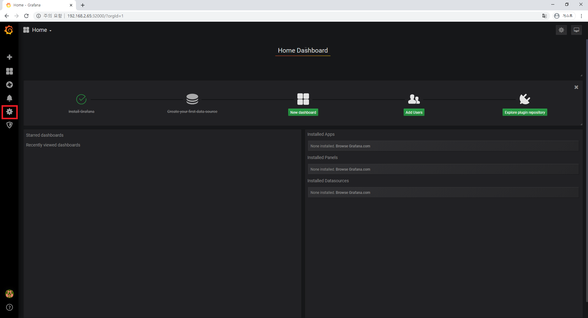
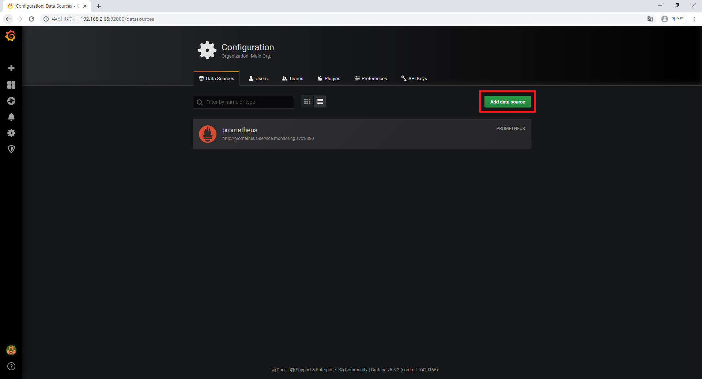
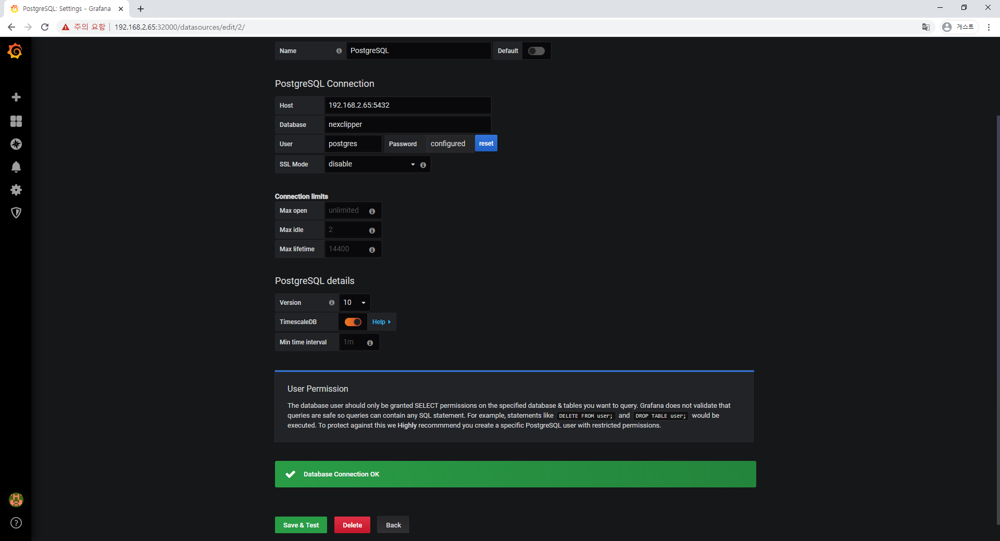

kubernetes가 설치되어있다는 전제하에 시작한다.

# Prerequisite
## System Requirements
- linux
- Go: 1.11 or above
- ProtocolBuffer Compiler
- TimescaleDB

## Setup build environments
```shell script
sudo apt install -y build-essential
sudo apt install -y protobuf-compiler
go get -u github.com/golang/protobuf/protoc-gen-go
export PATH=$PATH:~/go/bin
```

# Initialize database
## Install TimescaleDB (docker)

Refer to https://docs.timescale.com/latest/getting-started/installation document for other platform.

pull `timescaledb` docker image from [Docker Hub](https://hub.docker.com/r/timescale/timescaledb/).

```shell script
docker pull timescale/timescaledb:1.5.1-pg11
```

start with persistent storage

```shell script
docker run -d --name timescaledb -p 5432:5432 -e POSTGRES_PASSWORD=password \
  -v [/local/disk/storage]:/var/lib/postgresql/data \
  timescale/timescaledb:1.5.1-pg11
```
```shell script
docker ps | grep timescaledb

423f126c31b5        timescale/timescaledb:1.5.1-pg11   "docker-entrypoint.s…"   18 seconds ago         Up 2 hours          0.0.0.0:5432->5432/tcp   timescaledb
```

First connect to the PostgreSQL instance

```shell script
docker exec -it 423f bash

bash-5.0# psql -h localhost -U postgres
psql (11.5)
Type "help" for help.

postgres=#
```

Create `nexclipper` database

```bash
postgres=# CREATE DATABASE nexclipper;
CREATE DATABASE
postgres=# \q
bash-5.0# exit
exit
```

## Initialize tables

Excute database migration command

```shell script
go get github.com/NexClipper/NexClipper
cd ~/go/github.com/NexClipper/NexClipper

go mod download
go run cmd/migrate/migrate.go --db.host=localhost --db.user=postgres \
  --db.pass=password --db.name=nexclipper
```

# Start NexClipper
```shell script
kubectl create namespace nexclipper
```
## Start NexServer
```shell script
cd ~/go/github.com/NexClipper/NexClipper/deployment/kubernetes

vi nexserver.yaml

env 부분 수정
ex)
env:
            - name: NEXSERVER_DB_HOST
              value: "192.168.2.65"
            - name: NEXSERVER_DB_PORT
              value: "5432"
            - name: NEXSERVER_DB_USER
              value: "postgres"
            - name: NEXSERVER_DB_PASS
              value: "password"
            - name: NEXSERVER_DB_NAME
              value: "nexclipper"
```
```shell script
kubectl create -f nexserver.yaml
```

## Start NexAgent
```shell script
kubectl get svc -n nexclipper

NAME        TYPE       CLUSTER-IP     EXTERNAL-IP   PORT(S)           AGE
nexserver   NodePort   10.96.14.234   <none>        18000:30819/TCP   9s

vi nexagent.yaml

env 부분 수정
ex)
env:
            - name: NEXAGENT_SERVER_ADDRESS
              value: 192.168.2.65:30819
            - name: NEXAGENT_KUBERNETES_NAME
              value: k8s-cluster
            - name: NEXAGENT_KUBERNETES_NAMESPACE
              value: nexclipper
```
```shell script
kubectl create -f nexagent.yaml
```

# Install Prometheus and Grafana
## Install Prometheus
### Create a Namespace

```shell script
kubectl create namespace monitoring
```

### Create a Deployment
```yaml
apiVersion: rbac.authorization.k8s.io/v1beta1
kind: ClusterRole
metadata:
  name: prometheus
rules:
- apiGroups: [""]
  resources:
  - nodes
  - nodes/proxy
  - services
  - endpoints
  - pods
  verbs: ["get", "list", "watch"]
- apiGroups:
  - extensions
  resources:
  - ingresses
  verbs: ["get", "list", "watch"]
- nonResourceURLs: ["/metrics"]
  verbs: ["get"]
---
apiVersion: rbac.authorization.k8s.io/v1beta1
kind: ClusterRoleBinding
metadata:
  name: prometheus
roleRef:
  apiGroup: rbac.authorization.k8s.io
  kind: ClusterRole
  name: prometheus
subjects:
- kind: ServiceAccount
  name: default
  namespace: monitoring
```

```shell script
kubectl create -f clusterRole.yaml
```

### Create a Config Map
```yaml
apiVersion: v1
kind: ConfigMap
metadata:
  name: prometheus-server-conf
  labels:
    name: prometheus-server-conf
  namespace: monitoring
data:
  prometheus.yml: |-
    global:
      scrape_interval: 5s
      evaluation_interval: 5s

    scrape_configs:
      - job_name: 'kubernetes-apiservers'
        kubernetes_sd_configs:
        - role: endpoints
        scheme: https
        tls_config:
          ca_file: /var/run/secrets/kubernetes.io/serviceaccount/ca.crt
        bearer_token_file: /var/run/secrets/kubernetes.io/serviceaccount/token
        relabel_configs:
        - source_labels: [__meta_kubernetes_namespace, __meta_kubernetes_service_name, __meta_kubernetes_endpoint_port_name]
          action: keep
          regex: default;kubernetes;https

      - job_name: 'kubernetes-nodes'
        scheme: https
        tls_config:
          ca_file: /var/run/secrets/kubernetes.io/serviceaccount/ca.crt
        bearer_token_file: /var/run/secrets/kubernetes.io/serviceaccount/token
        kubernetes_sd_configs:
        - role: node
        relabel_configs:
        - action: labelmap
          regex: __meta_kubernetes_node_label_(.+)
        - target_label: __address__
          replacement: kubernetes.default.svc:443
        - source_labels: [__meta_kubernetes_node_name]
          regex: (.+)
          target_label: __metrics_path__
          replacement: /api/v1/nodes/${1}/proxy/metrics

      - job_name: 'kubernetes-pods'
        kubernetes_sd_configs:
        - role: pod
        relabel_configs:
        - source_labels: [__meta_kubernetes_pod_annotation_prometheus_io_scrape]
          action: keep
          regex: true
        - source_labels: [__meta_kubernetes_pod_annotation_prometheus_io_path]
          action: replace
          target_label: __metrics_path__
          regex: (.+)
        - source_labels: [__address__, __meta_kubernetes_pod_annotation_prometheus_io_port]
          action: replace
          regex: ([^:]+)(?::\d+)?;(\d+)
          replacement: $1:$2
          target_label: __address__
        - action: labelmap
          regex: __meta_kubernetes_pod_label_(.+)
        - source_labels: [__meta_kubernetes_namespace]
          action: replace
          target_label: kubernetes_namespace
        - source_labels: [__meta_kubernetes_pod_name]
          action: replace
          target_label: kubernetes_pod_name

      - job_name: 'kubernetes-cadvisor'
        scheme: https
        tls_config:
          ca_file: /var/run/secrets/kubernetes.io/serviceaccount/ca.crt
        bearer_token_file: /var/run/secrets/kubernetes.io/serviceaccount/token
        kubernetes_sd_configs:
        - role: node
        relabel_configs:
        - action: labelmap
          regex: __meta_kubernetes_node_label_(.+)
        - target_label: __address__
          replacement: kubernetes.default.svc:443
        - source_labels: [__meta_kubernetes_node_name]
          regex: (.+)
          target_label: __metrics_path__
          replacement: /api/v1/nodes/${1}/proxy/metrics/cadvisor

      - job_name: 'kubernetes-service-endpoints'
        kubernetes_sd_configs:
        - role: endpoints
        relabel_configs:
        - source_labels: [__meta_kubernetes_service_annotation_prometheus_io_scrape]
          action: keep
          regex: true
        - source_labels: [__meta_kubernetes_service_annotation_prometheus_io_scheme]
          action: replace
          target_label: __scheme__
          regex: (https?)
        - source_labels: [__meta_kubernetes_service_annotation_prometheus_io_path]
          action: replace
          target_label: __metrics_path__
          regex: (.+)
        - source_labels: [__address__, __meta_kubernetes_service_annotation_prometheus_io_port]
          action: replace
          target_label: __address__
          regex: ([^:]+)(?::\d+)?;(\d+)
          replacement: $1:$2
        - action: labelmap
          regex: __meta_kubernetes_service_label_(.+)
        - source_labels: [__meta_kubernetes_namespace]
          action: replace
          target_label: kubernetes_namespace
        - source_labels: [__meta_kubernetes_service_name]
          action: replace
          target_label: kubernetes_name
```

```shell script
kubectl create -f config-map.yaml
```

### Create a Prometheus Deployment

```shell script
apiVersion: apps/v1
kind: Deployment
metadata:
  name: prometheus-deployment
  namespace: monitoring
spec:
  replicas: 1
  selector:
    matchLabels:
      app: prometheus-server
  template:
    metadata:
      labels:
        app: prometheus-server
    spec:
      containers:
        - name: prometheus
          image: prom/prometheus:v2.2.1
          args:
            - "--config.file=/etc/prometheus/prometheus.yml"
            - "--storage.tsdb.path=/prometheus/"
          ports:
            - containerPort: 9090
          volumeMounts:
            - name: prometheus-config-volume
              mountPath: /etc/prometheus/
            - name: prometheus-storage-volume
              mountPath: /prometheus/
      volumes:
        - name: prometheus-config-volume
          configMap:
            defaultMode: 420
            name: prometheus-server-conf

        - name: prometheus-storage-volume
          emptyDir: {}
---
apiVersion: v1
kind: Service
metadata:
  name: prometheus-service
  namespace: monitoring
  annotations:
      prometheus.io/scrape: 'true'
      prometheus.io/port:   '9090'

spec:
  selector:
    app: prometheus-server
  type: NodePort
  ports:
    - port: 8080
      targetPort: 9090
      nodePort: 30000
```

```shell script
kubectl create -f prometheus-deployment.yaml
```

## Install Grafana
### Create a Configmap

```yaml
apiVersion: v1
kind: ConfigMap
metadata:
  name: grafana-datasources
  namespace: monitoring
data:
  prometheus.yaml: |-
    {
        "apiVersion": 1,
        "datasources": [
            {
               "access":"proxy",
                "editable": true,
                "name": "prometheus",
                "orgId": 1,
                "type": "prometheus",
                "url": "http://prometheus-service.monitoring.svc:8080",
                "version": 1
            }
        ]
    }
```

```shell script
kubectl create -f grafana-datasource-config.yaml
```

### Create a Grafana Deployment
```yaml
apiVersion: apps/v1
kind: Deployment
metadata:
  name: grafana
  namespace: monitoring
spec:
  replicas: 1
  selector:
    matchLabels:
      app: grafana
  template:
    metadata:
      name: grafana
      labels:
        app: grafana
    spec:
      containers:
      - name: grafana
        image: grafana/grafana:latest
        ports:
        - name: grafana
          containerPort: 3000
        resources:
          limits:
            memory: "2Gi"
            cpu: "1000m"
          requests:
            memory: "1Gi"
            cpu: "500m"
        volumeMounts:
          - mountPath: /var/lib/grafana
            name: grafana-storage
          - mountPath: /etc/grafana/provisioning/datasources
            name: grafana-datasources
            readOnly: false
      volumes:
        - name: grafana-storage
          emptyDir: {}
        - name: grafana-datasources
          configMap:
              defaultMode: 420
              name: grafana-datasources
---
apiVersion: v1
kind: Service
metadata:
  name: grafana
  namespace: monitoring
  annotations:
      prometheus.io/scrape: 'true'
      prometheus.io/port:   '3000'
spec:
  selector: 
    app: grafana
  type: NodePort  
  ports:
    - port: 3000
      targetPort: 3000
      nodePort: 32000
```

```shell script
kubectl create -f deployment.yaml
```

# NexClipper와 Grafana 연동
## Grafana 접속
http://localhost:32000 으로 접속하면 grafana 페이지가 나온다.

초기 ID: admin, PW: admin 으로 접속 후 Configuration(빨간 네모) - Data Sources로 들어간다.



timescaledb(postgresql)와 연동하기 위해 Add data source 클릭



SQL 항목에 있는 PostgreSQL을 클릭한다.

아래와 같이 항목을 작성한 후 `Save & Test` 버튼을 클릭하면 `Database Connection OK` 라는 메세지가 뜬다.

