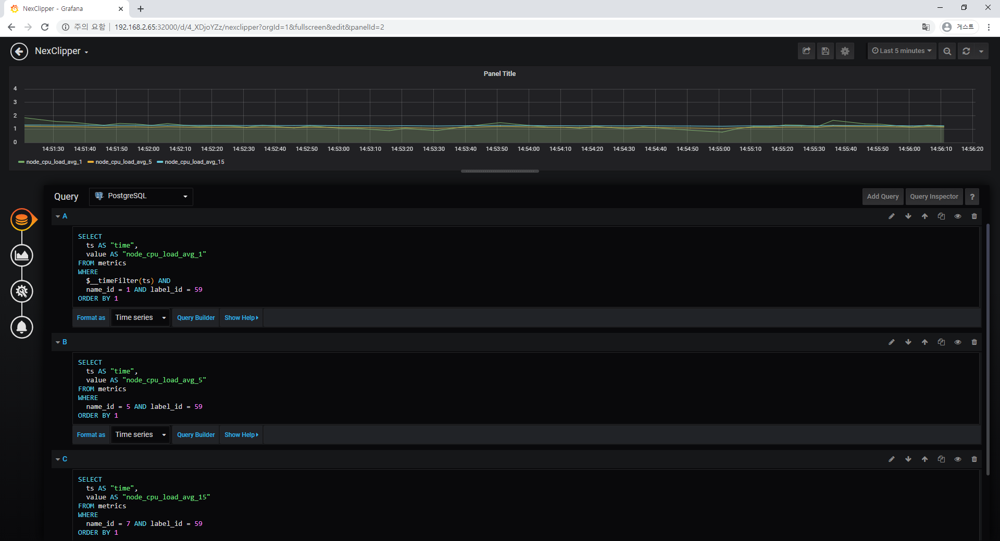

쿠버네티스 모니터링으로 프로메테우스가 가장 많이 사용되지만 엔터프라이즈 환경에서는 다음과 같이 지원되지 않는 몇가지 문제가 있다.
- 데이터 스토리지: 내구성이 낮은 데이터 스토리지는 롱텀 데이터 저장을 못한다.
- logging - 이벤트 로깅 시스템이 아니라 메트릭스를 수집하고 처리하도록 설계 되었다.
- automatic horizontal scaling
- user management
- 여러 클러스터, 서로 다른 서버 메트릭에 대한 글로벌 뷰
- 엔드포인트 증가에 따른 확장성
- 방화벽 내의 엔드포인트 접근

이런 문제들을 해결하기 위해 타노스, 콜텍스등 여러 솔루션들이 나오고 있으며 이중 [NexClipper](https://github.com/NexClipper/NexClipper)를 통한 Kubernetes 모니터링을 소개 하고자 한다.

NexClipper는 아래 그림과 같이 쿠버네티스 모니터링에 최적화 되어있으며, 각 노드도 모니터링 할 수 있게 도와주는 솔루션이다. 물론 OpenMetrics도 지원을한다.


NexClipper로 metric들을 수집하여 Grafana로 모니터링 하는 방법을 소개한다.

Kubernetes가 설치되어 있다는 전제하에 진행한다.

# Prerequisite

## System Requirements
- linux
- Go: 1.11 or above
- ProtocolBuffer Compiler
- TimescaleDB

## Setup build environments
```shell script
sudo apt install -y build-essential
sudo apt install -y protobuf-compiler
go get -u github.com/golang/protobuf/protoc-gen-go
export PATH=$PATH:~/go/bin
```

# Initialize database
## Install TimescaleDB (docker)

Refer to https://docs.timescale.com/latest/getting-started/installation document for other platform.

pull `timescaledb` docker image from [Docker Hub](https://hub.docker.com/r/timescale/timescaledb/).

```shell script
docker pull timescale/timescaledb:1.5.1-pg11
```

start with persistent storage

```shell script
docker run -d --name timescaledb -p 5432:5432 -e POSTGRES_PASSWORD=password \
  -v [/local/disk/storage]:/var/lib/postgresql/data \
  timescale/timescaledb:1.5.1-pg11
```
```shell script
docker ps | grep timescaledb

423f126c31b5        timescale/timescaledb:1.5.1-pg11   "docker-entrypoint.s…"   18 seconds ago         Up 2 hours          0.0.0.0:5432->5432/tcp   timescaledb
```

First connect to the PostgreSQL instance

```shell script
docker exec -it 423f bash

bash-5.0# psql -h localhost -U postgres
psql (11.5)
Type "help" for help.

postgres=#
```

Create `nexclipper` database

```bash
postgres=# CREATE DATABASE nexclipper;
CREATE DATABASE
postgres=# \q
bash-5.0# exit
exit
```

## Initialize tables

Excute database migration command

```shell script
go get github.com/NexClipper/NexClipper
cd ~/go/github.com/NexClipper/NexClipper

go mod download
go run cmd/migrate/migrate.go --db.host=localhost --db.user=postgres \
  --db.pass=password --db.name=nexclipper
```

# Start NexClipper
```shell script
kubectl create namespace nexclipper
```
## Start NexServer
```shell script
cd ~/go/github.com/NexClipper/NexClipper/deployment/kubernetes

vi nexserver.yaml

env 부분 수정
ex)
env:
            - name: NEXSERVER_DB_HOST
              value: "192.168.2.65"
            - name: NEXSERVER_DB_PORT
              value: "5432"
            - name: NEXSERVER_DB_USER
              value: "postgres"
            - name: NEXSERVER_DB_PASS
              value: "password"
            - name: NEXSERVER_DB_NAME
              value: "nexclipper"
```
```shell script
kubectl create -f nexserver.yaml
```

## Start NexAgent
```shell script
kubectl get svc -n nexclipper

NAME        TYPE       CLUSTER-IP     EXTERNAL-IP   PORT(S)           AGE
nexserver   NodePort   10.96.14.234   <none>        18000:30819/TCP   9s

vi nexagent.yaml

env 부분 수정
ex)
env:
            - name: NEXAGENT_SERVER_ADDRESS
              value: 192.168.2.65:30819
            - name: NEXAGENT_KUBERNETES_NAME
              value: k8s-cluster
            - name: NEXAGENT_KUBERNETES_NAMESPACE
              value: nexclipper
```
```shell script
kubectl create -f nexagent.yaml
```

# Install Grafana
## Create a Configmap

```yaml
apiVersion: v1
kind: ConfigMap
metadata:
  name: grafana-datasources
  namespace: monitoring
data:
  prometheus.yaml: |-
    {
        "apiVersion": 1,
        "datasources": [
            {
               "access":"proxy",
                "editable": true,
                "name": "prometheus",
                "orgId": 1,
                "type": "prometheus",
                "url": "http://prometheus-service.monitoring.svc:8080",
                "version": 1
            }
        ]
    }
```

```shell script
kubectl create -f grafana-datasource-config.yaml
```

## Create a Grafana Deployment
```yaml
apiVersion: apps/v1
kind: Deployment
metadata:
  name: grafana
  namespace: monitoring
spec:
  replicas: 1
  selector:
    matchLabels:
      app: grafana
  template:
    metadata:
      name: grafana
      labels:
        app: grafana
    spec:
      containers:
      - name: grafana
        image: grafana/grafana:latest
        ports:
        - name: grafana
          containerPort: 3000
        resources:
          limits:
            memory: "2Gi"
            cpu: "1000m"
          requests:
            memory: "1Gi"
            cpu: "500m"
        volumeMounts:
          - mountPath: /var/lib/grafana
            name: grafana-storage
          - mountPath: /etc/grafana/provisioning/datasources
            name: grafana-datasources
            readOnly: false
      volumes:
        - name: grafana-storage
          emptyDir: {}
        - name: grafana-datasources
          configMap:
              defaultMode: 420
              name: grafana-datasources
---
apiVersion: v1
kind: Service
metadata:
  name: grafana
  namespace: monitoring
  annotations:
      prometheus.io/scrape: 'true'
      prometheus.io/port:   '3000'
spec:
  selector: 
    app: grafana
  type: NodePort  
  ports:
    - port: 3000
      targetPort: 3000
      nodePort: 32000
```

```shell script
kubectl create -f deployment.yaml
```

# NexClipper와 Grafana 연동
## Grafana 접속
http://localhost:32000 으로 접속하면 grafana 페이지가 나온다.

초기 ID: admin, PW: admin 으로 접속 후 Configuration(빨간 네모) - Data Sources로 들어간다.


timescaledb(postgresql)와 연동하기 위해 Add data source 클릭


SQL 항목에 있는 PostgreSQL을 클릭한다.

아래와 같이 항목을 작성한 후 `Save & Test` 버튼을 클릭하면 `Database Connection OK` 라는 메세지가 뜬다.


## Dashboard 추가

왼쪽의 `+`버튼을 클릭한 후에 `create dashboard` 로 들어감
`Add Query` 를 클릭


`Query`를 `PostgreSQL`로 변경하고 아래와 같이 sql을 작성




# Result
NexClipper에서 metric들을 수집하여 TimescaleDB로 저장하고, 저장한 데이터들을 Grafana를 통해 손쉽게 Kubernetes를 모니터링 할 수 있다는 것을 알아보았다.

NexClipper와 TimescaleDB를 사용함으로써 다음과 같은 장점을 가진다

- 대용량 데이터의 저장 및 처리
- Openmetrics를 이용하여 다른 플랫폼과의 연동
- 무한한 확장성을 가지며 스토리지가 허용하는 만큼 최대한 메트릭 데이터 보관 가능

- 복잡한 네트워크 보안 정책이 적용되어 있는 환경에서도 Agent는 수집한 Metric정보를 서버로 전송하여 저장하고 조회 가능